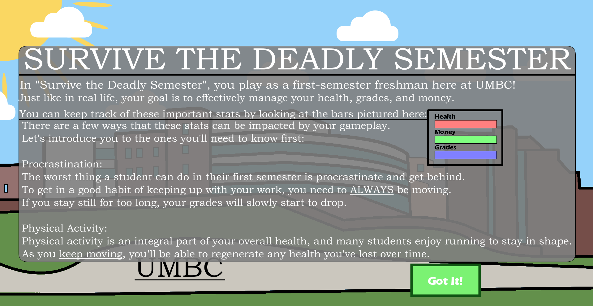
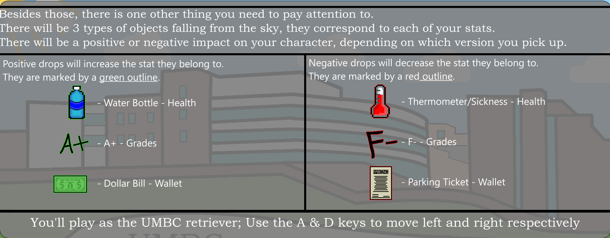

# Survive the Semester🎓🐾

**Survive the Semester** is a single-player arcade-style game created with Processing. You take on the role of True Grit, the UMBC mascot, as you navigate the challenges of your first semester!

## 🎮 Gameplay Overview

Obstacles and helpful items will rain down from the sky. You'll need quick reflexes to guide True Grit left and right, avoiding the pitfalls of college life while grabbing the essentials for success.

**Controls:**
* **A Key:** Move True Grit Left
* **D Key:** Move True Grit Right

**Your Goal:**
* **Avoid:**
    * Bad Grades 
    * Getting Sick 
    * Parking Tickets 
* **Collect:**
    * Good Grades 
    * Money 
    * Water (to stay healthy) 

The challenge increases over time – how long can you survive the semester?

## 🌟 Visuals Showcase

* **Gameplay in Action:**

    

  *(True Grit dodging obstacles and collecting items.)*

* **Main Menu:**
    

* **Tutorial Screen:**
    

## ✨ Features

* Arcade-style survival gameplay.
* Falling obstacles and collectible items.
* Simple keyboard controls.
* Increasing difficulty as the game progresses.

## 🛠️ Technologies Used

* **Processing** (Java)

## 🚀 How to Play

1.  Ensure you have the [Processing IDE](https://processing.org/download) installed.
2.  Download or clone this repository.
3.  Open the main `.pde` file in the Processing IDE.
4.  Click the "Run" (▶) button to start the game.

## 📝 Project Status

This is a completed project. No further updates are planned at this time.
